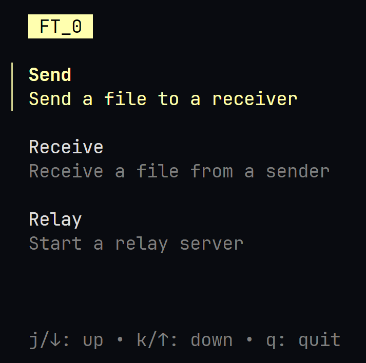

# FT_0

FT_0 is a file transfer application built in Go using the [Bubble Tea](https://github.com/charmbracelet/bubbletea) framework. It supports three main modes of operation: sending files, receiving files, and relaying files. FT_0 is designed to be a simple and lightweight TUI file transfer application that can be used for any type of file transfer.

## Installation

1. Clone the repository:

```bash
git clone https://github.com/yourusername/ft_0.git
cd ft_0
```

2. Install dependencies:

```bash
go mod tidy
```

3. Build the application:

```bash
go build -o ft_0
```

## Usage

To run the application, use the following command:

```bash
./ft_0
```



1. Send Mode:
   Select "Send" from the main menu.
   Choose a file to send.
   Share the session ID with the receiver.
2. Receive Mode:
   Select "Receive" from the main menu.
   Enter the session ID provided by the sender.
3. Relay Mode:
   Select "Relay" from the main menu.
   Press Enter to start the relay server.

## Structure

```bash
FT_0/
├── main.go             # Main entry point for the application
├── server/             # Server logic for sending, receiving, and relaying files
│   ├── main.go         # Modify this file to change the server configuration
│   ├── receiver.go
│   ├── relay.go
│   ├── sender.go
└── ui/                 # User interface logic for the different modes
    ├── main.go
    ├── mode.go
    ├── receive.go
    ├── relay.go
    └── send.go
```

## TODO

- Fixes:
  - [x] Send mode restarts on rejection/error
  - [ ] Switching between modes causes issues
  - [ ] Error handling
- Features:
  - [ ] Multiple file transfers
  - [ ] Custom relay servers
  - [ ] Encryption
  - [ ] Compression
  - [ ] Resuming interrupted transfers
  - [ ] Custom themes
